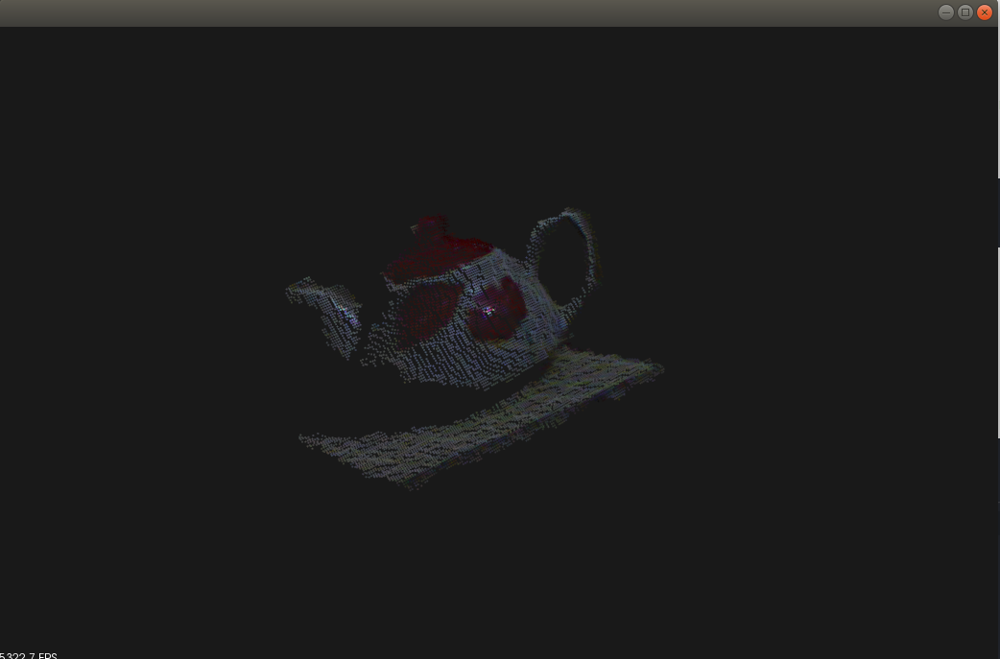

# Ch1 - Visualization

## Result



## Usage

### C++ Version

#### Run With docker (Optional)

```bash
$ xhost +local:root
```

```bash
$ docker run --rm -it \
    --gpus all \
    -e DISPLAY=$DISPLAY \
    -e QT_X11_NO_MITSHM=1 \
    --volume="$PWD:/root/PCL" \
    --volume="/tmp/.X11-unix:/tmp/.X11-unix:rw" \
    --privileged \
    kakalin/pcl:1.8.0
```

#### Build && Run

```bas
$ chmod +x build.sh

# Build
＄ ./build.sh

# Run
$ cd build
$ ./cloud_viewer
```

### Python version

```bash
$ python3 visiualization.py
```
