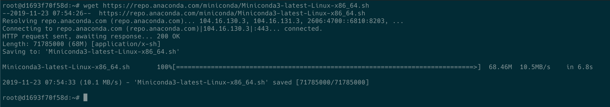
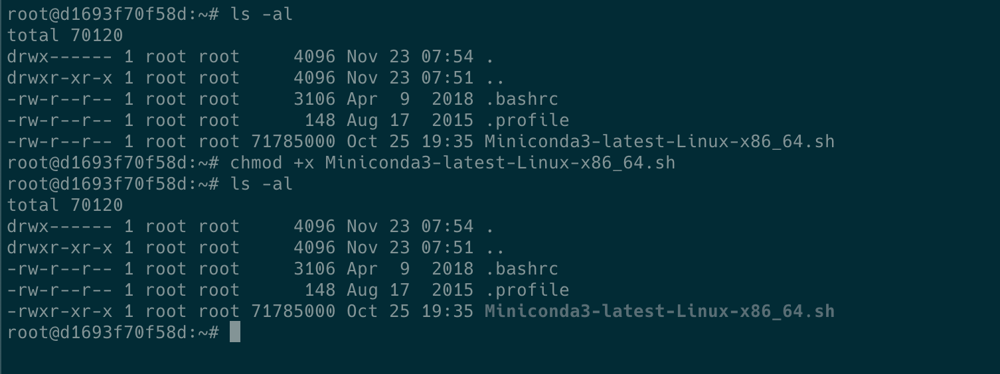
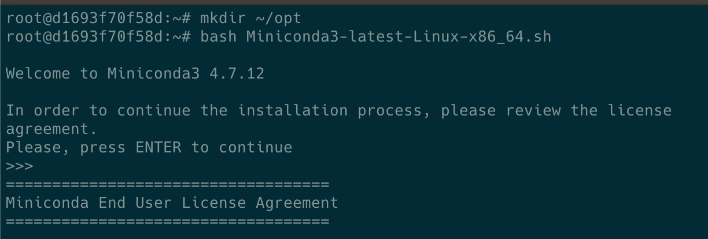
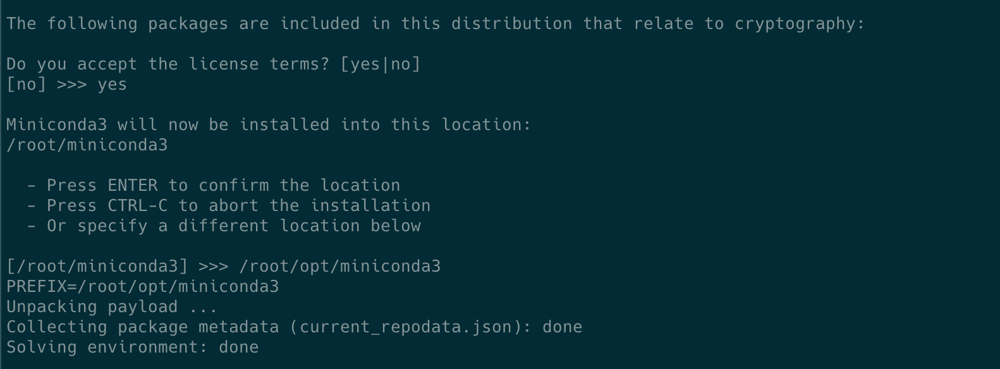
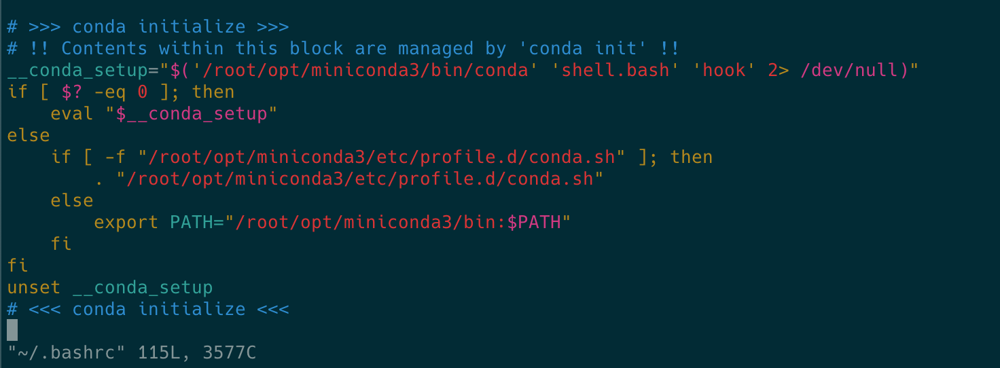
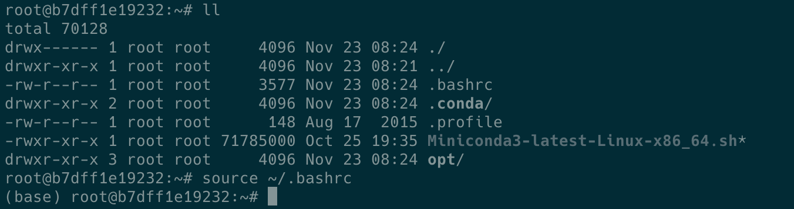
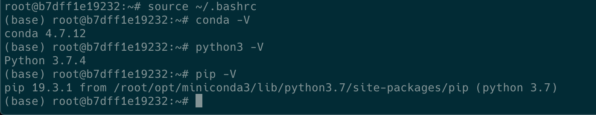

## 1. Install request package

```bash
$ sudo apt-get update && apt-get upgrade
$ sudo apt-get install wget vim
```

## 2. Install Python3 

[Miniconda](https://conda.io/projects/conda/en/latest/user-guide/install/linux.html)

### 2-1. Download installer

```bash 
$ wget https://repo.anaconda.com/miniconda/Miniconda3-latest-Linux-x86_64.sh
```




### 2-2. Change the access permissions of files

```
$ chmod +x Miniconda3-latest-Linux-x86_64.sh
```




### 2-3. Install
   
```bash
# install miniconda in ~/opt
$ mkdir -p ~/opt
$ bash Miniconda3-latest-Linux-x86_64.sh
```
    






### 2-4. Activate conda
    
#### 1. bash
    
* Copy `conda initialize` in `~/.bash_profile` to `~/.bashrc`, as below:




* Activate

```bash
$ source ~/.bashrc # or open new Terminal
```






