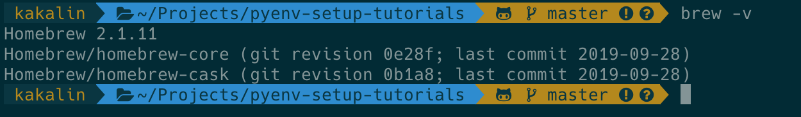
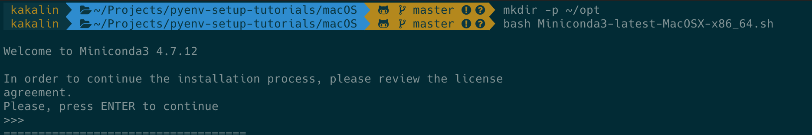
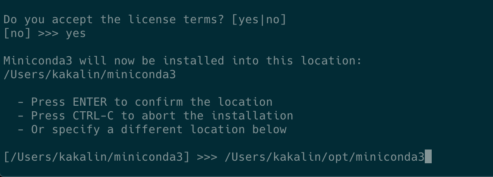
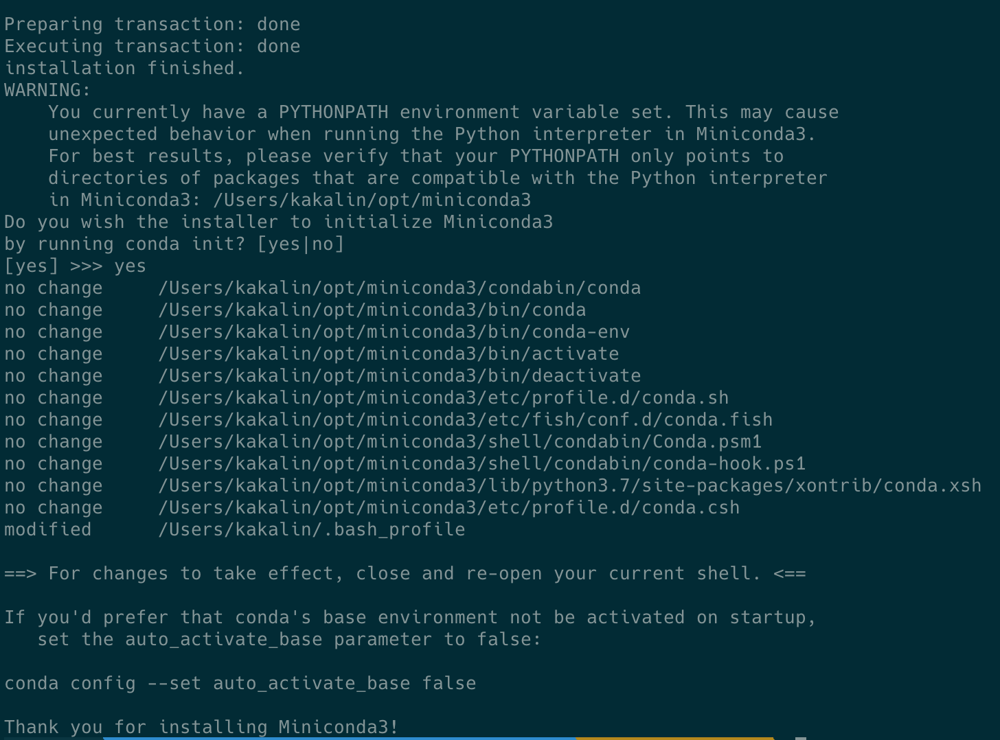
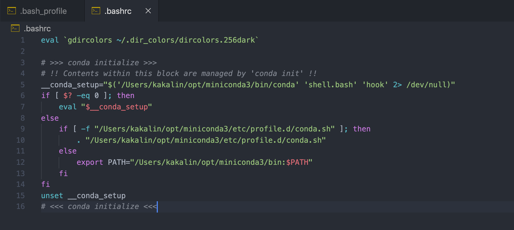
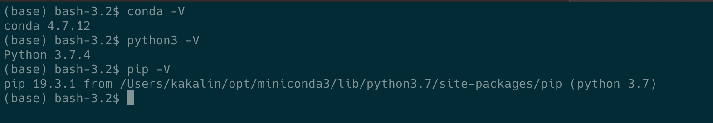
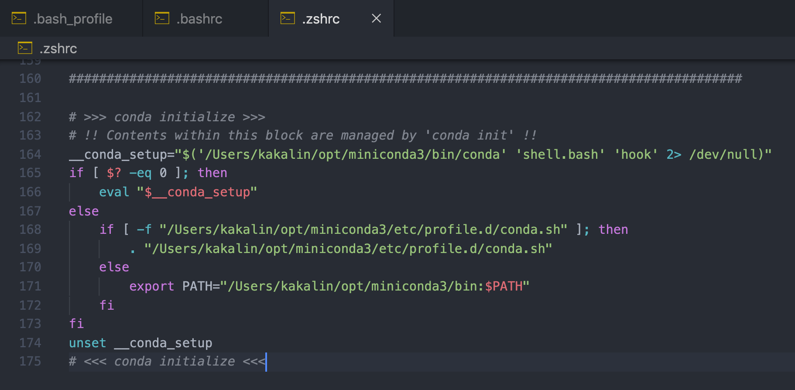
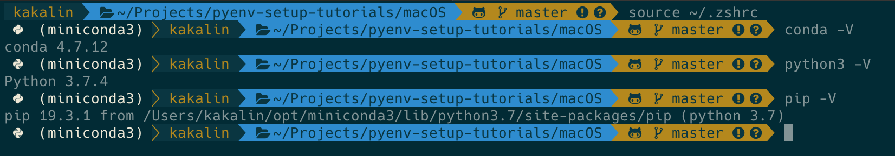

## 1. Install Package Manager

- [Homebrew](https://brew.sh/)
    
    It is the ```package manager``` for macOS. Following the install step on the website to install it. 

    
    

## 2. Install Python3 

### 2-1. Homebrew
   
```bash
$ brew install python
```

### 2-2. [Miniconda](https://conda.io/projects/conda/en/latest/user-guide/install/macos.html)

#### 1. Download installer

```bash 
$ wget https://repo.anaconda.com/miniconda/Miniconda3-latest-MacOSX-x86_64.sh
```

#### 2. Install
   
```bash
# install miniconda in ~/opt
$ mkdir -p ~/opt
$ chmod +x Miniconda3-latest-MacOSX-x86_64.sh
$ bash Miniconda3-latest-MacOSX-x86_64.sh
```
    







  

#### 3. Activate conda

##### 1. bash

* Copy `conda initialize` in `~/.bash_profile` to `~/.bashrc`, as below:


  

*  Activate

```bash
$ source ~/.bashrc # or open new Terminal
```




##### 2. zsh
    
* Copy `conda initialize` in `~/.bash_profile` to `~/.zshrc`, as below:


  

* Activate

```bash
$ source ~/.zshrc # or open new Terminal
```



