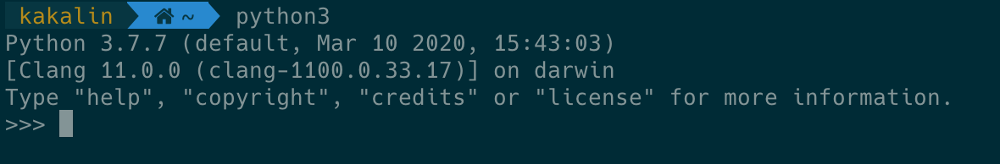
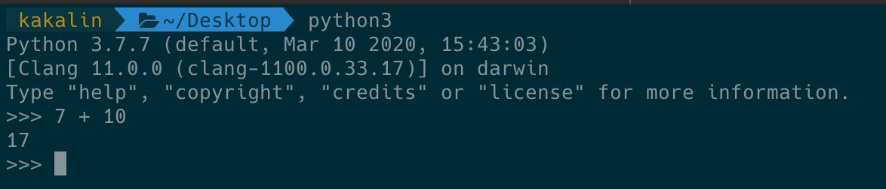
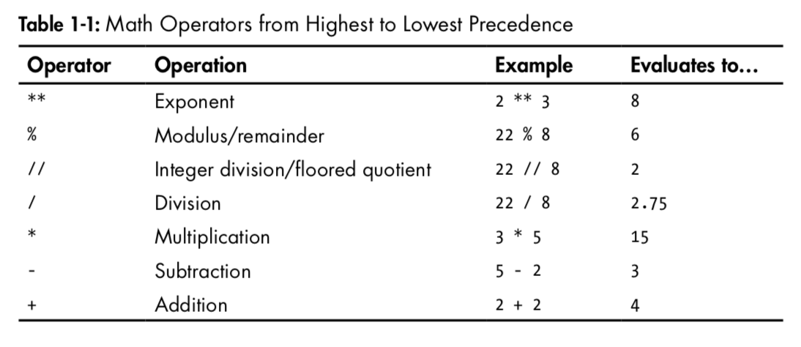
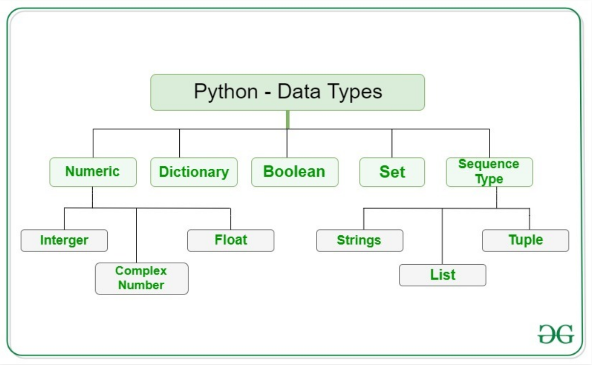
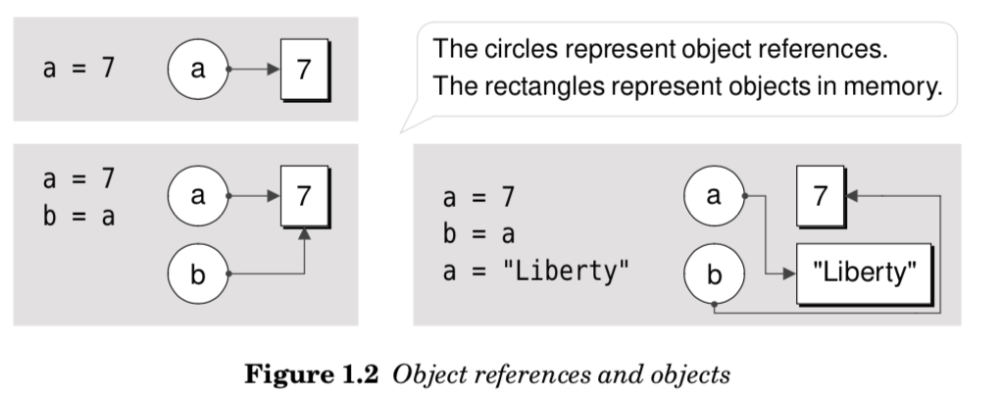

# Python Basics

## Interactive Shell

### Compiled language v.s. Interpreted language

- Compiled language (編譯語言)

    Through compiler convert source code into machine code and execute it.

    * C/C++
    * Go
    * Rust

- Interpreted language (直譯語言)
    
    Execute the code step-by-step.
    
    * Python
    * JavaScript
    * Ruby
    * PHP

### Python Interactive Shell

Python is a Interpreted language. It means it excutes the code line by line.

Python provides a `Python Shell (Python Interactive Shell)` 
which is used to execute a single Python command and get the result.


1. Open terminal

```bash
# or python3
$ python
```

2. Then you will see the figure below



3. Now, you can type a single statement and get the result



## Python Comments

Comments can be used to explain code, make the code more readable.

- `#`: single line
- `""" """`: multiple lines

Examples:

```python
# This is a comment
print('Hello world')

"""
This is a comment 
written in more than just one line
"""
print('Hello world')
```

## Python Expressions: Math Operators




```python
# Addition: Integer
2 + 3
```


    5


```python
# Addition: Floating point & Floating point -> Floating point
2.0 + 3.0
```


    5.0


```python
# Addition: Floating point & Integet -> Floating point
2.0 + 3
```


    5.0


```python
# Multiplication
3 * 2
```


    6


```python
# Exponent
2 ** 5
```


    32


### Exercise

```
Suppose you have $100, which you can invets with a 10% return each year.
After one year, it's 100 x 1.1 = 110 dollars, 
and after two years it's 100 x 1.1 x 1.1 = 121.
```

Add code to calculate how much money you end up with after 7 years, and print the result.


```python
# Click below for a solution

return_money = 100 * (1.1 ** 7)
return_money
```


    194.87171000000012


## Display the Output

Builtin-in function `print()` serves as an output statement in Python.


```python
# type 1.
print("Hello World!")

# type 2.
print("Hello" + " World1")

# type 3.
text = "world!"
print("Hello", text)

# type 4. 
text = "world!"
print("Hello {}".format(text))
```

    Hello World!
    Hello World1
    Hello world!
    Hello world!


## Getting the User's Input

The `input()` function is part of the core library of standard Python distribution.

It reads the key strokes as a string object which can be referred to by a variable having a suitable name.


```python
_input = input()

print("input: {}, type: {}".format(_input, type(_input)))
```

    123
    input: 123, type: <class 'str'>


```python
name = input("Enter your name: ")
print("Welcome, {}".format(name))
```

    Enter your name: kaka
    Welcome, kaka


## Variables

Variables are containers for storing data values.
In order to conveniently repeatedly refer to the store value, it is given a suitable name.

- Specific, case-sensitive name
- Call up value through variable name

A value is bound to a name by the assignment operator `=`

### Example

Height 1.75m, Weight 68.7kg, Calculate BMI

```python
height = 1.75
weight = 68.7

bmi = weight / (height ** 2)
print("BMI: {}".format(bmi))
```

## Data Types

Variables can store data of different types, and different types can do different things.

A `data type` is a category for values, and every value belongs to exactly one data type.

Python has the following standard or built-in data types:



### Numeric

- Integets (`int`): 1, 0, 1
- Float (`float`): -1.25, -0.5, 0.0, 1.25
- Complex (`complex`): 1j

### Boolean

Data with one of two built-in values `True` or `False`.


### Sequence

- Strings (`str`): 

    String literals in python are surrounded by either single quotation marks, or double quotation marks.
    
    'Hello' is the same as "Hello".
    
    Example:
    ```python
    a = 'Hello Wrold!'
    ```

- `list`:

    List is a collention which is `ordered` and `changeable`.
    Allow duplicate members.
    
    Example:
    ```python
    a = ['Hello', 'World', '!']
    ```

- `tuple`:
    Tuple is a collention which is `ordered` and `unchangeable`.
    Allow duplicate members.
    
    Example:

    ```python
    a = ('Hello', 'World', '!')
    ```

### Dictionary

Dictionary is a collention which is `unordered`, `changeable` and `indexed`.
No duplicate members.
    
Example:

```python
a = {"name": "kaka", "age": 28}
```

## Storing Values in Variables

### Assignment

在程式語言的世界裡，`=`代表的是指定(assignment)的意思

例如：`x = 7` 就是把`7這個物件指定給x這個變數`，換句話說也就是把`x這個變數指向(綁定)7這個物件`，如下圖所示：


```python
x = 7
x
```


    7


```python
x = 7
y = x
y
```


    7


```python
x = 8
print("x =", x, "y =", y)
```

    x = 8 y = 7


### Pyhton Assignmes: Bindding


```python
# Fist, we see an example as below:
x = [1, 2, 3]
y = x
x[1] = 100
print("x: ", x)
print("y: ", y)
```

    x:  [1, 100, 3]
    y:  [1, 100, 3]


#### Explain

Python的`=`實際上是 `binds an object reference to an object`



```python
x = [1, 2, 3]
```
```bash
X ----> [1 2 3]
```

---

```python
y = x
```
```bash
x ---> [1 2 3]
       ^
       |
y ------
```

---

```python
x[1] = 100
```
```bash
x ---> [100 2 3]
       ^
       |
y ------
```

## Your First Program

- Referece: [Automate the Boring Stuff with Python](https://automatetheboringstuff.com/)


```python
# This program says hello and asks for my name and age.
print('Hello World!')
print('What is your name?')
print('------------------')
name = input()
print('It is good to meet you, ' + name)
print('The length of your name is: ', len(name))
print('What is your age?')
age = input()
print('------------------')
print('You will be ' + str(int(age) + 1) + ' in a year') 
```

    Hello World!
    What is your name?
    ------------------
    kaka
    It is good to meet you, kaka
    The length of your name is:  4
    What is your age?
    28
    ------------------
    You will be 29 in a year

