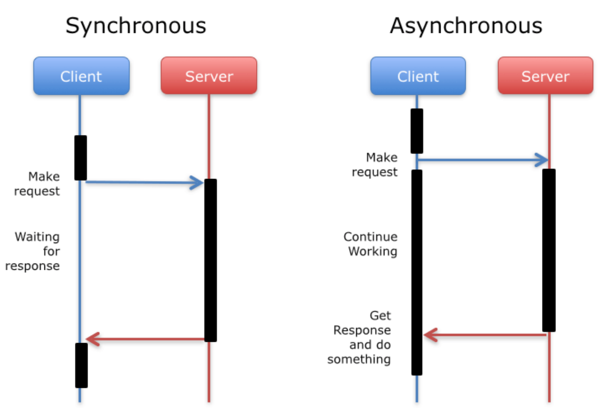

# 行程/處理程序(Process)

複習`作業系統(Operating System)`中的對於`行程(Process)`的解釋：

```
行程(Process)是指已經執行並且load到記憶體中的程式(Program)，
行程中的每一行程式碼隨時都有可能被CPU執行。

現在面向執行緒設計的系統中，行程本身不是基本執行單位，而是執行緒的容器

行程需要一些資源才能完成工作，如CPU使用時間、記憶體、檔案及I/O裝置。
```

我們在電腦裡，`點開應用程式就是將程式(Program)活化成行程/處理程序(Process)`。

每一個Process由下面兩項組成：

- 一個Memory Space，用來進行變數的存取。

    不同Process的Memory Space也不同，所以彼此之間變數不能共享。
- 一個以上的Thread(執行緒)

## 1. CPU 與 Process

一個CPU一次只能執行一個Process，現在的電腦都是`多核因此可同時執行數個Process`。

`但CPU的總量總是少於Process的運行總量`，且`Procee會佔用記憶體`，因此如何`排程(Scheduling)`，
如合有效的`管理記憶體(Memory)`就是作業系統(OS)在關注處理的事。

## 2. Thread 與 Process

Thread是OS能夠進行運算排成的最小單位，他被包含在Process之中，是Process中的實際運作單位。

- Thread是OS分配CPU時間的對象
- Process是OS分配資源的對象

## 總結

1. Process是電腦中已執行Program的實體，每一個Process互相獨立
2. Process需要一些資源才能完成工作，如CPU使用時間、記憶體、檔案及I/O裝置。
3. Process是基本執行單位Thread(執行緒)的容器
4. 每一個Process由一個Memory Space和一個以上的Thread所組成

# Python 模組: [multiprocessing](https://docs.python.org/3/library/multiprocessing.html#module-multiprocessing)

`multiprocessing`是Python的標準函式庫裡的模組，所以不需要另外安裝即可使用。

## 行程/處理程序(Process): `multiprocessing.Process`

### Step 1. 建立行程/處理程序(Process)

```python
class multiprocessing.Process(
    group=None, target=None, name=None, 
    args=(), kwargs={}, *, daemon=None)
```

### Step 2. 啟動(執行)Process

```python
Process.start()
```

### Step 3. 等待Process結束

```python
Process.join([timeout]
```

### Example

```python
import time
import multiprocessing

def job(process_id):
    proc = multiprocessing.current_process()
    print("Process_{}, Name: {}, PID: {}".format(process_id, proc.name, proc.pid))
    time.sleep(1)

# 建立3個Process
p_list = []
for i in range(3):
    p_list.append(multiprocessing.Process(target=job, args=(i,)))
    
# 執行Process
for p in p_list:
    p.start()

# Main Process 繼續執行自己的工作
proc = multiprocessing.current_process()
print(proc.name, proc.pid)

# 等待所有Process執行結束
for p in p_list:
    p.join()

print("All Done.")
```

[Output]

    Process_0, Name: Process-1, PID: 39377
    Process_1, Name: Process-2, PID: 39378
    Process_2, Name: Process-3, PID: 39379
    MainProcess 39372
    All Done.

### 物件導向 (Class)

```python
import time
import multiprocessing

class MyProcess(multiprocessing.Process):
    def __init__(self):
        super(MyProcess, self).__init__()
    
    def run(self):
        print("{}, PID: {}".format(self.name, self.pid))
        time.sleep(1)

# 建立3個Process
p_list = []
for i in range(3):
    p_list.append(MyProcess())
    
# 執行Process
for p in p_list:
    p.start()

# Main Process 繼續執行自己的工作
proc = multiprocessing.current_process()
print("{}, PID: {}".format(proc.name, proc.pid))

# 等待所有Process執行結束
for p in p_list:
    p.join()

print("All Done.")
```

[Output]

    MyProcess-4, PID: 39380
    MyProcess-5, PID: 39381
    MyProcess-6, PID: 39382
    MainProcess, PID: 39372
    All Done.

## 行程池(Process Pool): `multiprocess.Pool`

在實際處理問題的過程中，很忙的時候可能有大量的任務要執行，閒的時候可能只有零星任務要執行。
那在很忙的時候，我們就需要創建大量的Procee，首先創建跟銷毀都需要一定時間。
再來就算我們創建了大量的Process，作業系統也不會他們同時執行，這樣反而會影響效率。
此時就需要利用`行程池`。

```
例如在進行系統管裡時，同時操控多個文件或是遠程控制多台主機，並行操作可以節省大量時間。
當操控的主機不多時，可以直接生成多個行程，但假設今天機台有上百台、上千台時，
手動去限制行程數量太麻煩，這時候就可以發揮Pool的功效。
```

### Step 1. 建立Pool

```python
class multiprocessing.pool.Pool(
     [processes[, initializer[, initargs[, maxtasksperchild[, context]]]]])
```

- processes: the number of worker process to use. If `processes` is `None` then the number returned by `os.cpu_count()` is used.


### Step 2. 執行&獲取返回值

```python
Pool.map(func, iterable[, chunksize])
```
    
- A parallel equivalent of the map() built-in function. `It blocks until the result is ready`.

#### Note:

`Process`與`Pool`最大的不同點就是：

- Pool有返回值
- Process無返回值

### 簡單範例

```python
import os
import multiprocessing

def job(x):
    return x * x

# 建立Pool, 並且設定Process數量
'''
cpu_count = os.cpu_count() # 4
pool = multiprocessing.Pool(processes=cpu_count)
'''
pool = multiprocessing.Pool()

# 用 map() 運行處理程序並捕獲結果
res = pool.map(job, range(10))
print(res)
```

[Output]

    [0, 1, 4, 9, 16, 25, 36, 49, 64, 81]

### 同步(Sync) v.s. 非同步(Async) 

在`multiprocess.Pool`的提供的方法裡我們可以發現，
每個方法都有另外一個尾巴加上`_async`的方法，如:
`map()` & `map_async()`。

#### 那到底有`_async`跟沒有`_async`差在哪呢？

現下我們先來介紹`同步(sync`)跟`非同步(async)`的概念！

所謂的同步與非同步指的是`執行緒(Thread)之間訊息通訊機制(溝通機制)的同步與否`，如下所示：




- `同步(synchronous communication)`:

    當一個要資料的Thread去跟一個負責給資料的Thread拿資料時，
    
    需要在那邊等待訊息回傳回來。
    
    ```
    在沒有得到結果前，該呼叫(call)就不會返回，
    但是一但呼叫返回，就會得到返回值(return value)。
    換句話說就是，呼叫者主動等待這個呼叫的結果。
    ```
    
- `非同步(asynchronous communication)`:

    當一個要資料的Thread去跟一個負責給資料的Thread拿資料時，
    
    不需要等待直接返回，等待訊息好的時候會自己通知要資料的Thread。
    
    ```
    在呼叫發出之後，這個呼叫(call function/API)會直接返回，所以沒有返回結果。
    當被呼叫者準備好之後，被呼叫者通過狀態來通知呼叫者，或通過callback函數來處理。
    ```

##### Example:

當你打去某家餐廳要訂位時，

- 同步: 
    
    ```
    餐廳服務生說，您稍等一下，"我查一下"，等查好了告訴你結果(返回結果)。
    ```
    
    
- 非同步: 

    ```
    餐廳服務生說，我查一下，"查好再打電話給你"，然後就掛電話了(不返回結果)，
    然後查好之後，他會主動打電話給你(在這裡老闆透過"回電"這種callback方式來處理)。
    ```

### pool.map() v.s. pool.map_async()

- `map(func, iterable[, chuncksize])`:

    ```
    A parallel equivalent of the `map()` built-in function.
    It blocks until the result is ready.
    ```

- `map_async(func, iterable[, chuncksize[, callable[, error_callback]]])`:

    ```
    A variant of the `map()` method which returns a result object.
    ```
    
    - Note: 最後要寫close和join來避免主程序結束後，子程序被迫關閉。

#### 1. pool.map()

```python
import os
import time
import multiprocessing

def job(x):
    result = x * x
    print("[In Pool]: {}".format(result))
    time.sleep(1)
    return result

pool = multiprocessing.Pool(os.cpu_count())

pool_output = pool.map(job, range(10))
print("將會阻塞直到子程序結束後才執行，返回值: {}".format(pool_output))

# close 和 join 是確保主程序結束後，子程序仍然繼續執行
pool.close()
pool.join()

print("Pool Done!!!")
```

[Output]

    [In Pool]: 1
    [In Pool]: 4
    [In Pool]: 0
    [In Pool]: 9
    [In Pool]: 16
    [In Pool]: 25
    [In Pool]: 36
    [In Pool]: 49
    [In Pool]: 81
    [In Pool]: 64
    將會阻塞直到子程序結束後才執行，返回值: [0, 1, 4, 9, 16, 25, 36, 49, 64, 81]
    Pool Done!!!

#### 2. pool.map_async()

```python
import os
import time
import multiprocessing

def job(x):
    result = x * x
    print("[In Pool]: {}".format(result))
    time.sleep(1)
    return result

pool = multiprocessing.Pool(os.cpu_count())

pool_output = pool.map_async(job, range(10))

print("將不會阻塞和子程序並行")
print("Main Process: {}".format(pool_output.get()))

# close 和 join 確保主程序結束後，子程序仍然繼續執行
pool.close()
pool.join()

print("Pool Done!!!")
```

[Output]

    [In Pool]: 0
    [In Pool]: 4
    [In Pool]: 1
    [In Pool]: 9
    將不會阻塞和子程序並行
    [In Pool]: 16
    [In Pool]: 36
    [In Pool]: 25
    [In Pool]: 49
    [In Pool]: 64
    [In Pool]: 81
    Main Process: [0, 1, 4, 9, 16, 25, 36, 49, 64, 81]
    Pool Done!!!

### pool.close() and pool.join()

如上範例所示，_async最後要寫close和join來避免主程序結束後，子程序被迫關閉。

- `close()`:

    ```
    Prevents any more tasks from being submitted to the pool. 
    Once all the tasks have been completed the worker processes will exit.
    
    停止接收新的任務，如果還有任務來，就會拋出異常
    ```

- `join()`:

    ```
    Wait for the worker processes to exit. 
    One must call close() or terminate() before using join().
    
    等待所有任務完成，必須在close或是terminate之後呼叫，否則會拋出異常
    ```

### _async 取的回傳結果: `multiprocess.pool.AsyncResult` 

如上範例所示，`_async`要`取得回傳的資料`需要使用`get()`方法

```python
class multiprocess.pool.AsyncResult
"""The class of the result returned by Pool.apply_async() and Pool.map_async()."""
```

##### Method:

- get([timeout]):

    ```
    Return the result when it arrives.
    ```

- wait([timeout]):

    ```
    Wait until the result is avalibale or until timeout seconds pass.
    ```

- read():

    ```
    Return whether the call has completed.
    ```

- successful():
    
    ```
    Return whether the call completed without raising an exception.
    ```
    
待更新～
