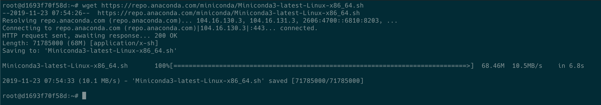
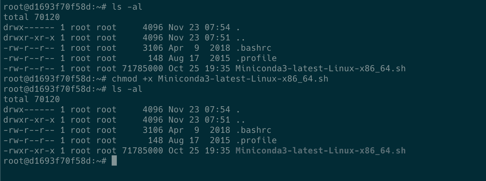
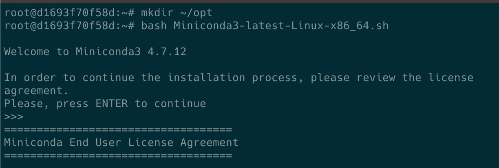
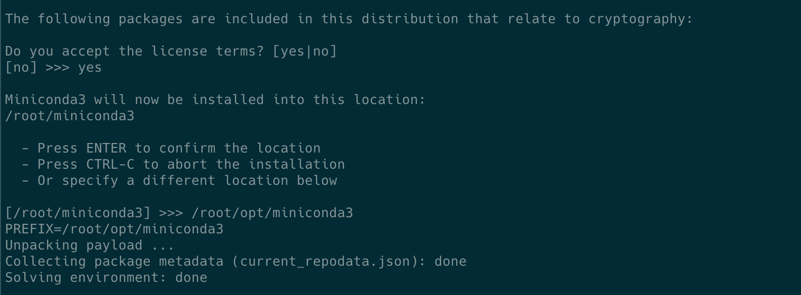
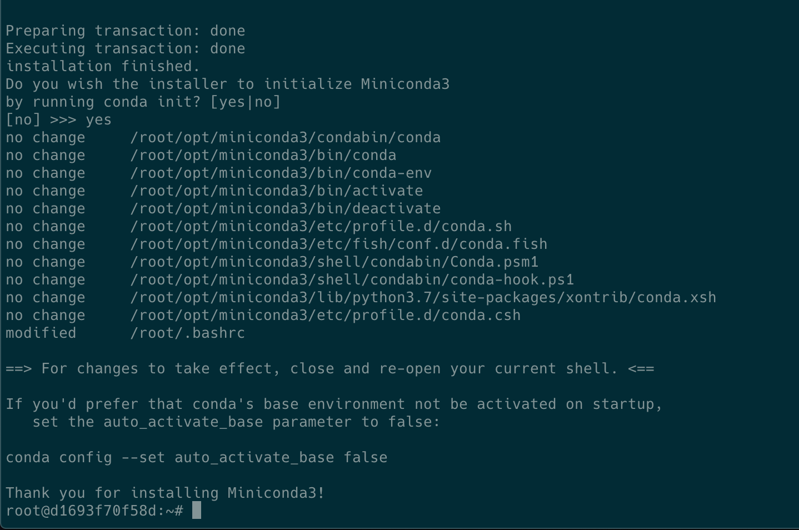
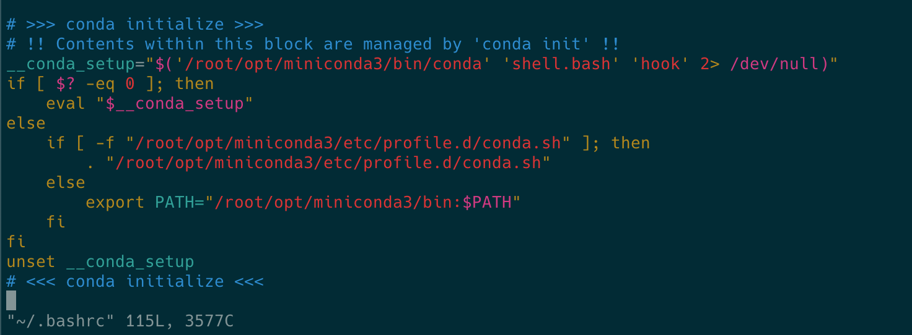
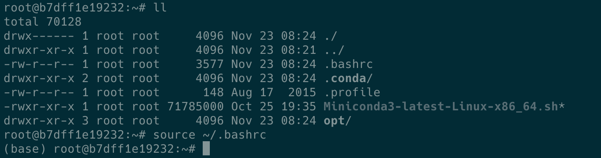
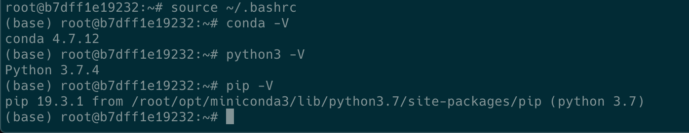

# Python Environment Setup on `Ubuntu`

## 1. Install request package

```bash
$ sudo apt-get update && apt-get upgrade
$ sudo apt-get install wget vim
```

## 2. Install Python3 

[Miniconda](https://conda.io/projects/conda/en/latest/user-guide/install/linux.html)

1. Download installer

    ```bash 
    $ wget https://repo.anaconda.com/miniconda/Miniconda3-latest-Linux-x86_64.sh
    ```

    

2. Change the access permissions of files

    ```
    $ chmod +x Miniconda3-latest-Linux-x86_64.sh
    ```

    

<div class="page"/>

3. Install
   
    ```bash
    # install miniconda in ~/opt
    $ mkdir -p ~/opt
    $ bash Miniconda3-latest-Linux-x86_64.sh
    ```
    
    

    

      

4. Activate conda
    
    - [bash](#bash)

<div class="page"/>

---

<span id="bash"></span>
#### 1. bash
    
* Copy `conda initialize` in `~/.bash_profile` to `~/.bashrc`, as below:

    

* Activate

    ```bash
     $ source ~/.bashrc # or open new Terminal
    ```

    

    
