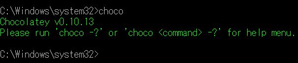
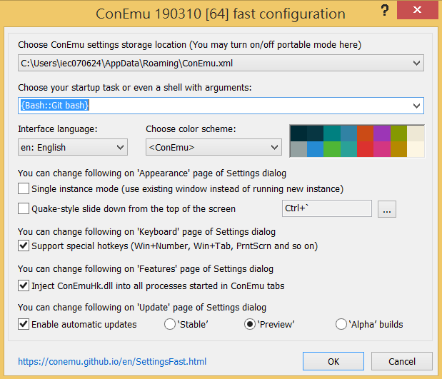
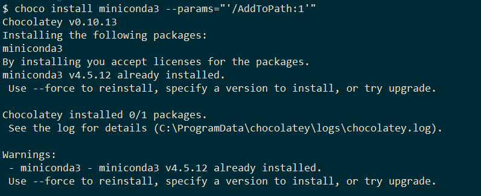
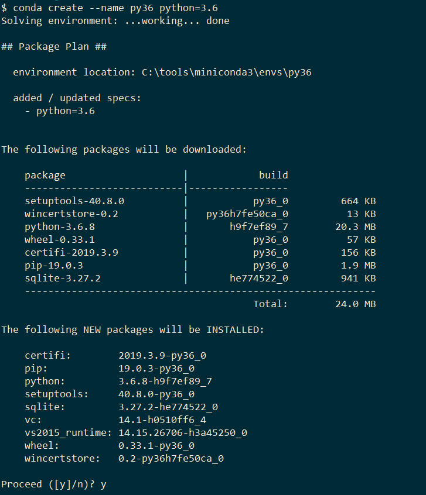
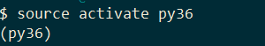
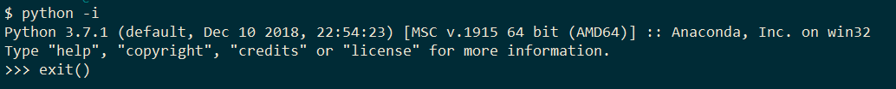

---
title: "Windows"
date: 2020-06-10
---

# Python Environment Setup on `Windows`

## 1. Install Package Manager

- [Chocolate](https://chocolatey.org/)
    
    It is the ```package manager``` for windows. Following the install step on the website to install it. 

    

## 2. Install More Handy Terminal

- [ConEmu](https://conemu.github.io/)

    Using ```choco``` to install it.

    ```cmd
    > choco install conemu
    ```

    

<div class="page"/>
  
## 3. Install Git Bash

- [Git for Window](https://gitforwindows.org/)

    Download and Install it.

## 4. Open ConEmu

Opening ```ConEmu``` and choose ```git bash```, then you can use ```Unix-commands```.

- [git bash]()
    
    

<div class="page"/>

## 5. Install Python3

1. Install ```Miniconda3```

    ```bash
    $ choco install miniconda3 --params="'/AddToPath:1'"
    ```

    

    then you can use ```conda``` and ```python```

2. If you want to use python3.6

    ```bash
    $ conda install python=3.6
    ```

    or create a new environment (Recommend)

    ```bash
    $ conda create --name py36 python=3.6
    ```

    

    

<div class="page"/>

3. Activate the environment of py36

    

    

---

## Note: 
    
Because git bash use ```MinTTY``` that doesn't support interactive operation, If you want to use python interactive shell, you can follow the method as follows

```bash
$ python -i 
```


