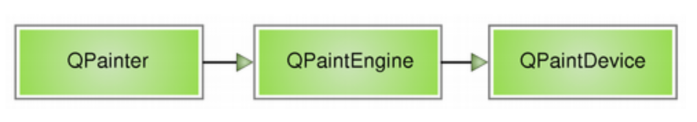

# Qt's Paint System

初探Qt的繪圖系統

## 前言

最近因為再研究`labeling tool`的關係，於是又重新把Qt的繪圖系統重新研究了一下

## Qt's Paint System

```
Qt's paint system enables painting on screen and print devices using the same API,
and is primarily based on the QPainter, QPaintDevice, and QPaintEngine classes.
```

Qt的繪圖系統允許我們使用相同的API在螢幕或印表機(print device)上繪畫，並且主要是基於[QPainter](https://doc.qt.io/qt-5/qpainter.html)，[QPainterDevice](https://doc.qt.io/qt-5/qpaintdevice.html)和[QPaintEngine](https://doc.qt.io/qt-5/qpaintengine.html)三個類。

- `QPainter`

    執行繪圖操作 (perform drawing operations)。

- `QPaintDevice`

    是一個二維空間的抽象，可以使用`QPainter`在上面進行繪製，也就是`QPainter`工作的空間。

- `QPaintEngine`

    提供了畫筆(painter)在不同設備進行繪製的統一的街口。

    `QPaintEngine`被`QPainter`和`QPaintDevice`內部使用，通常」通常對開發人員隱藏，除非你需要自定義一個設備，否則你不需要關心這個類。



### 小結

我們可以把`QPainter想成畫筆`，把`QPaintDevice想成使用畫筆的地方`，比如`紙張、螢幕`等。而對於紙張、螢幕而言，肯定要使用不同的畫筆繪製，爲了統一使用一種畫筆，我們設計了`QPaintEngine，這個類讓不同的紙張、螢幕都能使用一種畫筆`來繪製。.

## Example

再進行更深的討論之前，我們先來看個簡單的範例

`src/draw_rect.py`
```python
from PyQt5 import QtCore, QtGui, QtWidgets
from PyQt5.QtCore import Qt
from PyQt5.QtWidgets import QApplication, QMainWindow


class MainWindow(QMainWindow):
    def __init__(self, parent=None):
        super(MainWindow, self).__init__(parent)

        self._setup_ui()

    def _setup_ui(self):
        self.setWindowTitle("Drawing a Rectangle")
        self.setMinimumSize(640, 480)

    def paintEvent(self, event):
        painter = QtGui.QPainter(self)
        painter.setPen(QtGui.QPen(Qt.red, 5, Qt.SolidLine))
        painter.setBrush(QtGui.QBrush(Qt.green, Qt.DiagCrossPattern))
        painter.drawRect(270, 190, 100, 100)
```

上面這個範例就是利用`QPainter(畫筆)`在`QMainWindow(視窗)`上畫一個矩形。下一章我們會詳細介紹。
