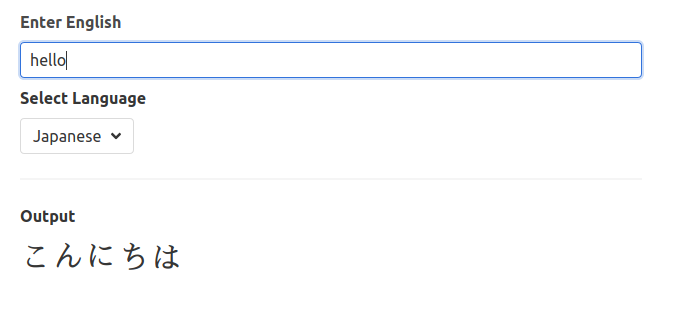
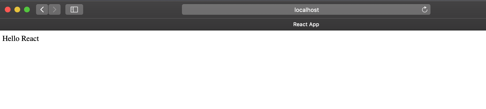

# Hello React

最近因為專案需要用到，於是又打開了兩年前在Udemy上買的[React課程](https://www.udemy.com/course/react-redux/)複習，
驚喜的發現講師有Update了2020版本上去，於是打算邊上課邊筆記記錄下來，
免得以後忘記又要重看一次。

## 用 `CodeSandBox` 練習

第一章首先就是利用[CodeSandBox](https://codesandbox.io/index2)(前端線上編輯器)帶你跑一個用React寫出來的簡單翻譯器，如下所示:



以下附上[練習](https://codesandbox.io/s/react-yud4c)及[答案](https://codesandbox.io/s/react-jg4cq)給大家參考。

## Generating a React App

再來就是教你如何在你的電腦上生成一個React的Project。

### 1. Install Node.js

- Ubuntu

    ```bash
    $ sudo apt update && sudo apt install curl
    $ curl -sL https://deb.nodesource.com/setup_14.x | sudo -E bash -
    $ sudo apt install nodejs
    ```

- Mac

    ```bash
    $ brew install node
    ```

### 2. Create A React App

We use [Create React App](https://github.com/facebook/create-react-app) to generate a react app.

```bash
$ npx create-react-app <app name>
$ cd <app name>
```

### 3. Start to write your app

使用`create-react-app`產生project後，我們可以將`src`裡面的檔案都刪掉，自己建新的`index.js`。也可以使用內建好的下去改，這邊刪掉是為了更好地理解`react`。

Before we start to write our app, we can delete all files in `<app name>/src`, and create a new `index.js`, `App.js`, and others files you need.

```bash
$ rm -rf src/*

$ touch src/index.js
```

#### `index.js` 如下所示

```javascript
// Import the React and ReactDOM libraries
import React from 'react';
import ReactDOM from 'react-dom';

// Create a react component
const App = () => {
  return (
    <div>Hello React</div>
  )
}

// Take the react component and show it on the screen
ReactDOM.render(
  <App />,
  document.querySelector('#root')
);
```

- `document.querySelector('#root')`

    其中的`root`是因為在`index.html裡<body>的<div>的id是root`，如下:

    ```html
    <body>
      <noscript>You need to enable JavaScript to run this app.</noscript>
      <div id="root"></div>
    </body>
    ```

### 4. Run you app

最後就是啟動我們的app。

```
$ npm start
```

結果如下所示：


