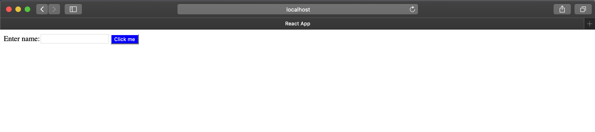

# JSX 介紹

首先看看下面這個變數宣告

```javascript
const element = <h1>你好，世界！</h1>;
```

這個有趣的標籤語法不是一個字串也不是`HTML`。

這個語法叫做`JSX`，他是`JavaScript的語法擴充`。他是用來產生`React 「element`，雖然他看起跟一些樣板語言(`HTML/XML`)很像，但不一樣的是`JSX允許你使用JavaScript的所有功能`。

## `Babel`

但有些人可能還是會覺得這明明就是`HTML`啊，到底差在哪裡呢？
在解釋前讓我們先來介紹[Babel](https://babeljs.io/)。

由於每年都會推出新的`ECMAScript`規範，讓工程師在使用JavaScript開發時可以更方便更簡潔。但瀏覽器的瀏覽器的支援速度卻更不上`ECMAScript`的更新速度，所以新版的JavaScript在現有的瀏覽器上的支援度很低，目前市面上支援度最高的大概就是`ES5`了，為了可以使用新版的JavaScript開發又可以讓瀏覽器支援，於是有需要相應的工具`將新版的JavaScript轉成ES5`，這時候`Babel`就誕生了。

```
Babel 就是用來將新版的JavaScript compile成ES5
```

## JSX 與 Babel

因為JSX是JavaScript的語法擴充，所以Babel也可以編譯JSX。
讓我們看看

JSX
```javascript
const App = () => {
  return <div>Hello React</div>;
}
```

編譯成
```javascript
const App = () => {
  return React.createElement(
      "div",
      null,
      "Hello React");
}
```

從上我們可以發現，其實JSX單純只是`React.createElement(component, props, ...children)`的語法糖，他的好處是可以很直觀的用樣板語言來描述UI，同時也不用寫一堆雜亂又冗長的`React.createElement()`code。

## JSX 與 HTML

雖然 JSX 看起來與 HTML 很像，但他們之間還是有不一樣的地方:

### 1. 標籤名稱:

HTML使用`lower case`，ReactDOM使用`lowerCamel `

HTML
```html
<div style="background-color: red;"></div>
```

JSX
```html
<div style={{ backgroundColor: 'red' }}></div>
```

### 2. JavaScript保留字:

`class`, `for`在javaScript裡面都是保留字，所以改成`className`, `htmlFor`

HTML
```html
<label class="label" for="name"></label>
<input id="name" type="text" />
```

JSX
```javascript
<label className="label" htmlFor="name"></label>
<input id="name" type="text" />
```

### 3. 在 JSX 中嵌入 `JavaScript Expression`

你可以在 JSX 的大括號中寫入任何合法的 JavaScript expression。舉例來說，`2 + 2`、`user.firstName` 以及 `formatName(user)` 都是合法的 JavaScript expression。

- Reference a JavaScript variable

    ```javascript
    const labelText = 'Enter name:';

    <label className="label" htmlFor="name">
        {labelText}
    </label>
    ```

- Use JavaScript's function

    ```javascript
    function formatName() {
        return "Kaka Lin";
    }

    const element = (
        <h1>
            Hello, {formatName()}!
        </h1>
    );
    ```

### 4. Styling

HTML
```html
<div style="background-color: red;"></div>
```

JSX
```javascript
<div style={{ backgroundColor: 'red' }}></div>
```

- 外層大括號: reference a JavaScript variable

- 內層大括號: indicate a JavaScript object

### 5. 在 JSX 中指定 Children

就像是在 XML 之中，如果一個標籤是空白的，你可以用 `/>` 立刻關閉這個標籤:

```javascript
const element = ;
```

JSX 標籤也可以包含 children:

```javascript
const element = (
  <div>
    <h1>Hello!</h1>
    <h2>Good to see you here.</h2>
  </div>
);
```

## Example

```javascript
// Import the React and ReactDOM libraries
import React from 'react';
import ReactDOM from 'react-dom';

// Create a react component
const App = () => {
  const buttonText = { text: 'Click me' };
  const labelText = 'Enter name:';

  return (
    <div>
      <label className="label" htmlFor="name">
        {labelText}
      </label>
      <input id="name" type="text" />
      <button style={{ backgroundColor: 'blue', color: 'white' }}>
        {buttonText.text}
      </button>
    </div>
  );
};

// Take the react component and show it on the screen
ReactDOM.render(<App />, document.querySelector('#root'));
```


