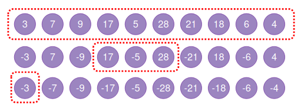
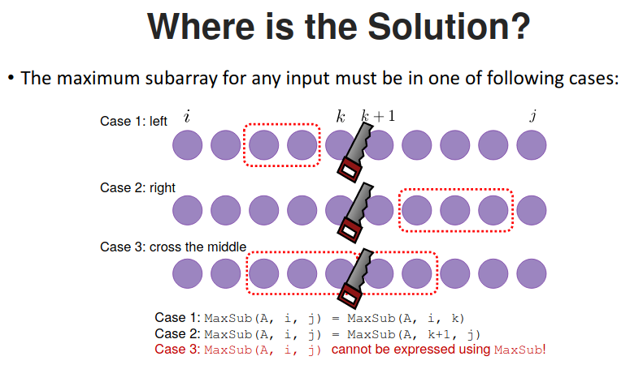
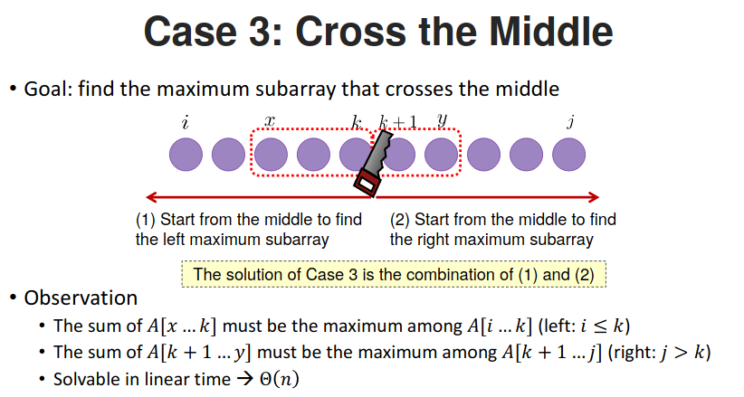

# Maximum Subarray Problem

- Input: A sequence A[1], A[2], ..., A[n] of integers.

- Output: Two indicex $i$ and $j$ with $1 {\leq} i {\leq} j {\leq} n$ that maximize

    $$A[i] + A[i+1] + \cdots + A[j]$$

## Solution 1. Divide and Conquer

- Base case (n = 1)
    - Return itself (maximum subarray)
- Recursive case (n > 1)
    - Divide the array into two sub-arrays
    - Find the maximum sub-array recuresively
    - Merge the result

## Bitonic Champion Problem Complexity

- Upper bound: $O(n)$

- Lower bound: $\Omega(n)$

## Reference

1. [ADA, NTU CSIE](https://www.csie.ntu.edu.tw/~yvchen/f108-ada/doc/190919_Divide-and-Conquer-1.pdf)
