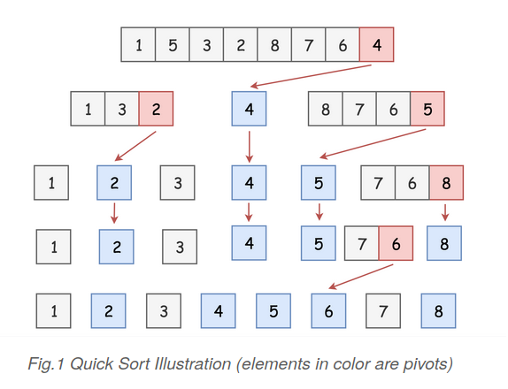
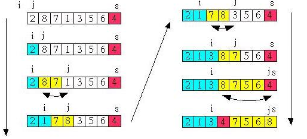

# Quick Sort

[Quick sort](https://en.wikipedia.org/wiki/Quicksort) is another classical `divide-and-conquer` algorithm for sorting.

## Intuition

The quick sort algorithm can be implemented in three steps, namely `dividing the problem`, `solving the subproblems` and `combing the results of subproblems`.

In detail, given a list of values to sort, the quick sort algorithm works in following steps:

1. First, it selects a value from the list, which serves as a `pivot` value to divide the list into two sublists. One sublist contains all the values that are less than the pivot value, while the other sublist contains the values that are greater than or equal to the pivot value. This process is also called `partitioning`.  

    ```
    The strategy of choosing a pivot value can vary. Typically, one can choose the first element in the list as the pivot, or randomly pick an element from the list.
    ```

2. After the partitioning process, the original list is then reduce into two smaller sublists. We then `recursively` sort the two sublists.

3. After the partitioning process, we are sure that all elements in one sublist are less or equal than any element in another sublist. Therefore, we can simply `concatenate` the two sorted sublists that we obtain in step 2 to obtain the final sorted list.

The base cases of the recursion in step 2 are either when the input list is empty or the empty list contains only a single element. In either case, the input list can be considered as sorted already.

<p>
    
    <br>
    <center><em>Fig.1  Quick Sort</em></center> 
</p>

## Algorithm

The pivot selection and partitioning steps can be done in several different ways.

### 1. Lomuto partition scheme

1. Pick the last element as a pivot value.

2. Use two pointer i and j
    - if element of index j less than pivot -> swap i and j and then i + 1. 

3. After the iteration process, swap the pivot and the elemet of index i. 


<p>
    
    <br>
    <center><em>Fig.2  Lomuto partition scheme</em></center> 
</p>

## Reference

1. [Quick Sort(wiki)](https://en.wikipedia.org/wiki/Quicksort)

2. [快速排序 Quicksort](https://rust-algo.club/sorting/quicksort/#lomuto-partition-scheme)

3. [快速排序法（三）](https://openhome.cc/Gossip/AlgorithmGossip/QuickSort3.htm)
