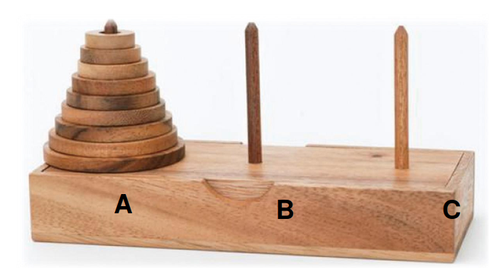

# Tower of Hanoi

- Problem: move n disks from A to C
- Rules:
    - Move one disk at a time.
    - Cannot place a large dosk onto a smaller disk.

## Reference

1. [ADA, NTU CSIE](https://www.csie.ntu.edu.tw/~yvchen/f108-ada/doc/190919_Divide-and-Conquer-1.pdf)
