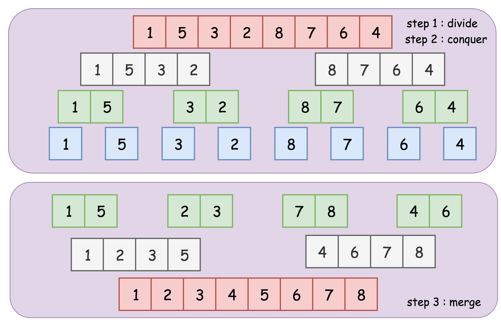
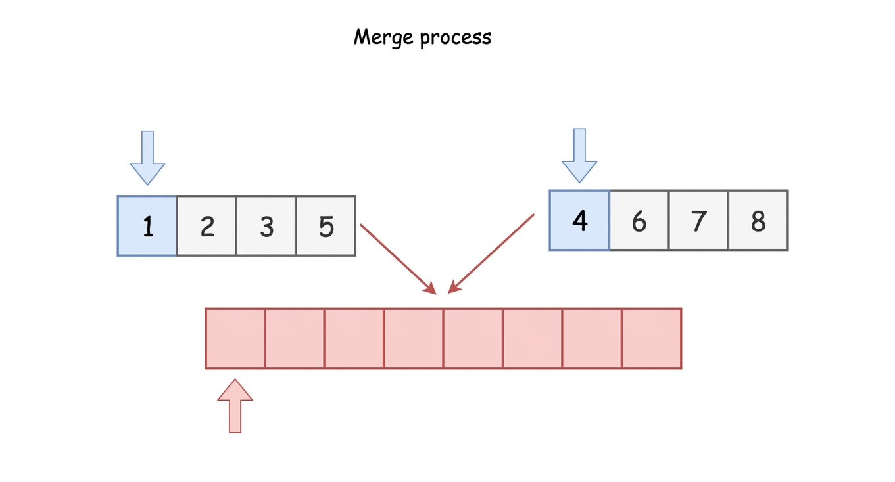
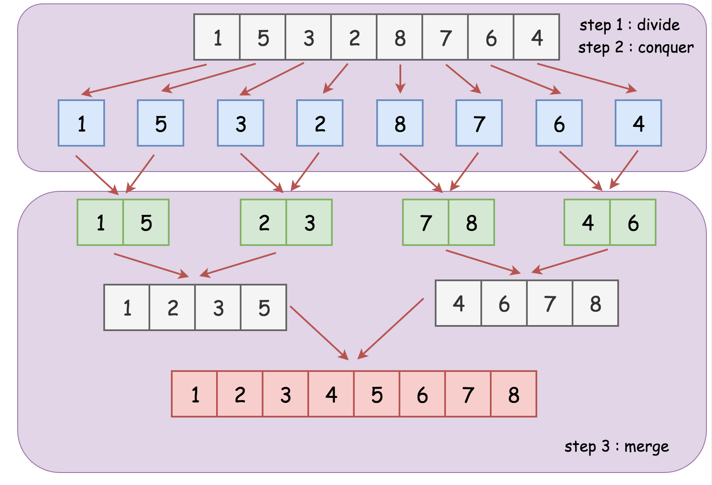

# Merge Sort

One of the classic examples of the divide-and-conquer algorithm is the merge sort algorithm. Merge sort is an efficient and general-purpose sorting algorithm.

## Intuition

There are two apporaches to implement the merge sort algorithm: [top-down](#topdown) or [bottom-up](#bottomup).

The merge sort algorithm can be divided into three steps, like all `divide-and-conquer` algorithms.

    1. Divide the given unsorted list into several sublists. (Divide)
    2. Sort each of the sublists recursively. (Conquer)
    3. Merge the sorted sublists to produce new sorted list. (Combine)

## 1. Top-down Approach (Recursion):

    1. In the first step, we divide the list into two sublists. (Divide)
    2. The in the next step, we recursively sort the sublists in the previous step. (Conquer)
    3. Finally we merge the sorted sublists in the above step repeatedly to obtain the final list of sorted elements. (Combine)

    
     
    
<em>Fig.1  Top-down Merge Sort</em>
 

We demonstrate an example of the merge process as following:

### Other gifs of merge sort

## 2. Bottom-up Approach (Iteratively)

In the `bottom-up` approach

    1. In the first, We divide the list into the sublists of a single element. (Divide)
    2. Each of the sublists is then sorted already. (Conquer)
    3. Finally we merge the sublist two at a time until a single list remains. (Combine)

    
     
    
<em>Fig.2  Bottom-up Merge Sort</em>
 

## Reference

1. [合併排序(wiki)](https://zh.wikipedia.org/zh-tw/%E5%BD%92%E5%B9%B6%E6%8E%92%E5%BA%8F)

2. [LeetCode learn - Recursion II, Divide and Conquer](https://leetcode.com/explore/learn/card/recursion-ii/470/divide-and-conquer/2868/)

3. [初學者學演算法｜排序法進階：合併排序法](https://medium.com/appworks-school/%E5%88%9D%E5%AD%B8%E8%80%85%E5%AD%B8%E6%BC%94%E7%AE%97%E6%B3%95-%E6%8E%92%E5%BA%8F%E6%B3%95%E9%80%B2%E9%9A%8E-%E5%90%88%E4%BD%B5%E6%8E%92%E5%BA%8F%E6%B3%95-6252651c6f7e)
