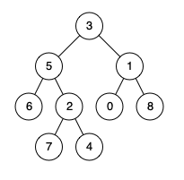

# 236. Lowest Common Ancestor of a Binary Tree

#### Discription

Given a binary tree, find the `lowest common ancestor (LCA)` of two given nodes in the tree.

According to the [definition of LCA on Wikipedia](https://en.wikipedia.org/wiki/Lowest_common_ancestor): “The lowest common ancestor is defined between two nodes p and q as the lowest node in T that has both p and q as descendants (where we allow a node to be a descendant of itself).”

Given the following binary tree:  root = [3,5,1,6,2,0,8,null,null,7,4]



#### Example1:

```
Input: root = [3,5,1,6,2,0,8,null,null,7,4], p = 5, q = 1
Output: 3
Explanation: The LCA of nodes 5 and 1 is 3.
```

#### Example2:

```
Input: root = [3,5,1,6,2,0,8,null,null,7,4], p = 5, q = 4
Output: 5
Explanation: The LCA of nodes 5 and 4 is 5, since a node can be a descendant of itself according to the LCA definition.
```

#### Note:

- All of the nodes' values will be unique.
- p and q are different and both values will exist in the binary tree.

## Solution: Recursive

Youtube: [Lowest Common Ancestor Between 2 Binary Tree Nodes (A Recursive Approach)](https://www.youtube.com/watch?v=py3R23aAPCA)

- Runtime: 72 ms (98.28%)
- Memory Usage: 25.7 MB (42.25%)

```python
# Definition for a binary tree node.
# class TreeNode:
#     def __init__(self, x):
#         self.val = x
#         self.left = None
#         self.right = None

class Solution:
    def lowestCommonAncestor(self, root: 'TreeNode', p: 'TreeNode', q: 'TreeNode') -> 'TreeNode':    
        if root is None or root == p or root == q:
            return root
            
        left = self.lowestCommonAncestor(root.left, p, q)
        right = self.lowestCommonAncestor(root.right, p, q)
        
        if left is None:
            return right
        if right is None:
            return left
        
        return root
```

### Time complexity

- O(n)

### Space complexity

- O(h), worst case: h = n
